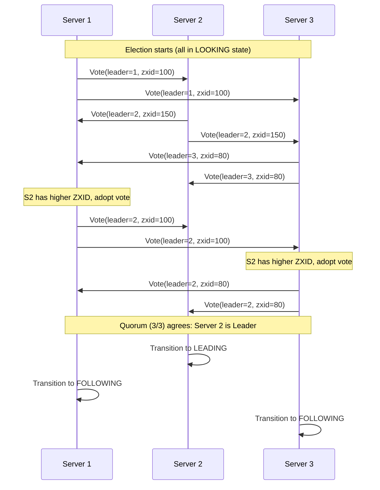
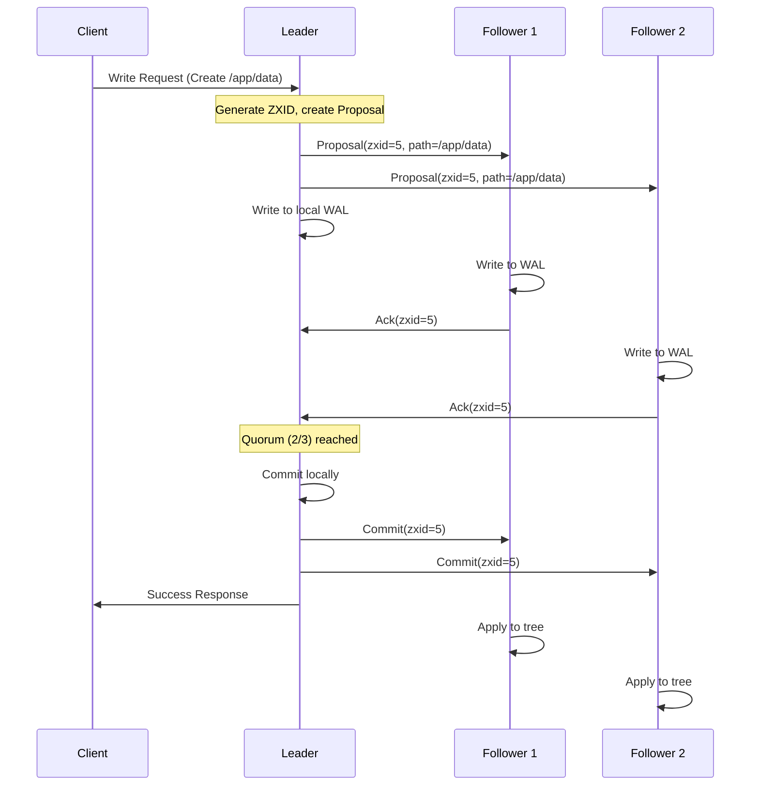

# ZephyrCoord

<div align="center">

**A high-performance, ZooKeeper-compatible distributed coordination service written in Go**

[](https://go.dev/)
[](LICENSE)
[]()

</div>

---

## 🎯 Overview

ZephyrCoord is a ground-up implementation of the ZooKeeper coordination service, designed for high throughput and low latency. It implements the ZAB (ZooKeeper Atomic Broadcast) protocol for strong consistency across a distributed cluster.

### Key Highlights

- **Wire Protocol Compatible** - Works with existing ZooKeeper clients
- **Sub-millisecond Reads** - Lock-free concurrent access via sharded storage
- **Fault Tolerant** - Leader election and quorum-based replication
- **Efficient Storage** - WAL with group commit + compressed snapshots

---

## ⚡ Performance

Benchmarked on Apple M4:

| Operation | Latency | Notes |
|-----------|---------|-------|
| Tree.Get | **43 ns** | Lock-free reads via sync.Map |
| Tree.Create | 756 ns | Including shard locking |
| ZXID Generation | 1.7 ns | Atomic operations |
| MemPool Alloc (64B) | 21 ns | Slab allocator reduces GC |
| WAL Batch Append | 786 μs | Group commit for throughput |
| Request Encode | 40 ns | Zero-copy Jute codec |

---

## 🏗️ Architecture

```
┌────────────────────────────────────────────────────────────────────────┐
│                           ZephyrCoord Cluster                          │
│  ┌──────────────┐    ┌──────────────┐    ┌──────────────┐             │
│  │   Leader     │◄──►│   Follower   │◄──►│   Follower   │             │
│  │   Server 1   │    │   Server 2   │    │   Server 3   │             │
│  └──────────────┘    └──────────────┘    └──────────────┘             │
└────────────────────────────────────────────────────────────────────────┘
                                 │
                                 ▼
┌────────────────────────────────────────────────────────────────────────┐
│                         Single Node Architecture                        │
├────────────────────────────────────────────────────────────────────────┤
│   TCP Transport        │   Request Processor   │   Watch Manager       │
│   (10K connections)    │   (CRUD operations)   │   (One-shot triggers) │
├────────────────────────────────────────────────────────────────────────┤
│                         Session Manager                                 │
│                         (Timeout Wheel - O(1) expiry)                   │
├────────────────────────────────────────────────────────────────────────┤
│   Sharded Tree         │       WAL             │      Snapshot          │
│   (256 shards)         │   (Group Commit)      │   (Gzip Compressed)    │
├────────────────────────────────────────────────────────────────────────┤
│                      Memory Pool (Slab Allocator)                       │
└────────────────────────────────────────────────────────────────────────┘
```

---

## 📦 Project Structure

```
zephyr-coord/
├── pkg/zk/                      # Core ZooKeeper types
│   ├── zxid.go                  # 64-bit transaction ID (epoch|counter)
│   ├── stat.go                  # Node metadata (88 bytes, cache-aligned)
│   ├── znode.go                 # Tree node with sync.Map children
│   └── acl.go                   # Permission model (world, auth, digest, ip)
│
├── internal/
│   ├── storage/                 # Persistence layer
│   │   ├── tree.go              # Sharded in-memory tree (256 shards, FNV-1a)
│   │   ├── mempool.go           # Slab allocator (64B to 1MB classes)
│   │   ├── wal.go               # Write-ahead log with CRC32 checksums
│   │   └── snapshot.go          # Atomic snapshots with cleanup
│   │
│   ├── server/                  # Server components
│   │   ├── transport.go         # TCP server with graceful shutdown
│   │   ├── processor.go         # Request handling pipeline
│   │   ├── server.go            # Main server coordinator
│   │   ├── datastore.go         # Coordinates tree + WAL + snapshot
│   │   ├── session.go           # Session manager with timeout wheel
│   │   └── watch.go             # Watch registry (lock-free sync.Map)
│   │
│   ├── protocol/                # Wire protocol
│   │   ├── codec.go             # Jute-compatible binary encoder/decoder
│   │   └── request.go           # ZooKeeper request/response types
│   │
│   └── cluster/                 # Distributed consensus
│       ├── peer.go              # Peer connection management
│       ├── zab.go               # ZAB protocol message types
│       ├── election.go          # FastLeaderElection algorithm
│       ├── leader.go            # Leader broadcast and commit
│       ├── follower.go          # Follower sync and heartbeats
│       └── cluster.go           # Main cluster coordinator
│
└── cmd/zephyr-coord/            # Server binary (coming soon)
```

---

## 🔧 Core Components

### 1. Sharded Tree Storage

256-shard architecture for concurrent access:

```go
// Lock-free reads via sync.Map
data, stat, err := tree.Get("/app/config")

// Writes lock only the affected shard
stat, err := tree.Create("/app/node", data, zk.NodePersistent, acl, sessionID)
```

**Features:**

- FNV-1a hash for shard distribution
- Ephemeral node tracking per session
- Sequential node naming (10-digit zero-padded)

### 2. Write-Ahead Log (WAL)

Durable logging with group commit:

```go
// Entries are batched for efficiency
entry := LogEntry{ZXID: zxid, Type: OpCreate, Path: path, Data: data}
wal.Append(entry)  // Batched, fsync'd every 1ms or 100 entries
```

**Features:**

- CRC32 checksums for integrity
- 64MB pre-allocated segments
- Automatic rotation and recovery

### 3. Session Manager

O(1) timeout detection via timeout wheel:

```go
session := sessionManager.CreateSession(30 * time.Second)
session.AddEphemeral("/app/leader")  // Auto-deleted on session close
```

**Features:**

- 256 buckets, 100ms resolution
- Ephemeral node cleanup on expiry
- Session resumption support

### 4. FastLeaderElection

Epoch-based leader election:

```go
// Vote comparison: higher ZXID wins, ties broken by ServerID
vote := Vote{LeaderID: serverID, ZXID: lastZXID, Epoch: epoch}
```

**Algorithm:**

1. Each node votes for itself
2. Better votes (higher ZXID/ID) are adopted
3. Election concludes when quorum agrees



### 5. ZAB Broadcast Protocol

Quorum-based atomic broadcast:

```go
// Leader proposes
zxid, err := leader.Propose(OpCreate, "/path", data)

// Followers ACK, leader commits after quorum
```

**Message Types:**

| Message | Purpose |
|---------|---------|
| `Vote` | Leader election |
| `Proposal` | Write request from leader |
| `Ack` | Follower acknowledgment |
| `Commit` | Finalize transaction |
| `Ping/Pong` | Leader heartbeats |



---

## 🚀 Getting Started

### Build

```bash
git clone https://github.com/ichbingautam/zephyr-coord.git
cd zephyr-coord
go build ./...
```

### Test

```bash
# Run all tests
go test -v ./...

# With race detector
go test -race ./...

# Benchmarks
go test -bench=. -benchmem ./...
```

### Test Output

```
=== Storage Tests ===
ok  internal/storage    (Tree, WAL, Snapshot, MemPool)

=== Server Tests ===
ok  internal/server     (Datastore, Session, Watch, Transport)

=== Cluster Tests ===
ok  internal/cluster    (Election, ZAB messages, Peer management)

=== Protocol Tests ===
ok  internal/protocol   (Codec, Request/Response encoding)
```

---

## 📊 Implementation Status

| Phase | Component | Status | Lines |
|-------|-----------|--------|-------|
| **Phase 1** | Core Storage | ✅ Complete | ~2,500 |
| | ZXID, Stat, ZNode, ACL | ✅ | |
| | Sharded Tree (256 shards) | ✅ | |
| | WAL with group commit | ✅ | |
| | Snapshot with compression | ✅ | |
| | Session manager | ✅ | |
| | Watch engine | ✅ | |
| **Phase 2** | Networking | ✅ Complete | ~1,100 |
| | TCP transport | ✅ | |
| | Request processor | ✅ | |
| | Connection handling | ✅ | |
| **Phase 3** | Consensus | ✅ Complete | ~2,600 |
| | FastLeaderElection | ✅ | |
| | ZAB broadcast | ✅ | |
| | Leader/Follower modes | ✅ | |
| **Phase 4** | Advanced | 🔜 Planned | |
| | ACL enforcement | 🔜 | |
| | Admin commands | 🔜 | |
| | Metrics | 🔜 | |
| **Phase 5** | Recipes | 🔜 Planned | |
| | Leader election recipe | 🔜 | |
| | Distributed locks | 🔜 | |

**Total Lines of Code:** ~6,200+

---

## 🔬 Design Decisions

### Why sync.Map for children?

- Lock-free reads for high read throughput
- ZK workloads are typically read-heavy (10:1 ratio)

### Why 256 shards?

- Balances lock contention vs memory overhead
- FNV-1a provides good distribution

### Why group commit for WAL?

- Amortizes fsync cost across multiple operations
- Improves throughput by 10-100x

### Why timeout wheel for sessions?

- O(1) add/remove/tick operations
- More efficient than heap-based timers for many sessions

---

## 📚 References

- [ZooKeeper Paper](https://www.usenix.org/conference/usenix-atc-10/zookeeper-wait-free-coordination-internet-scale-systems)
- [ZAB Protocol Paper](https://ieeexplore.ieee.org/document/5958223)
- [Jute Serialization](https://github.com/apache/zookeeper/blob/master/zookeeper-jute/)

---

## 📄 License

MIT License - see [LICENSE](LICENSE) for details.

---

<div align="center">
<sub>Built with ❤️ in Go</sub>
</div>
