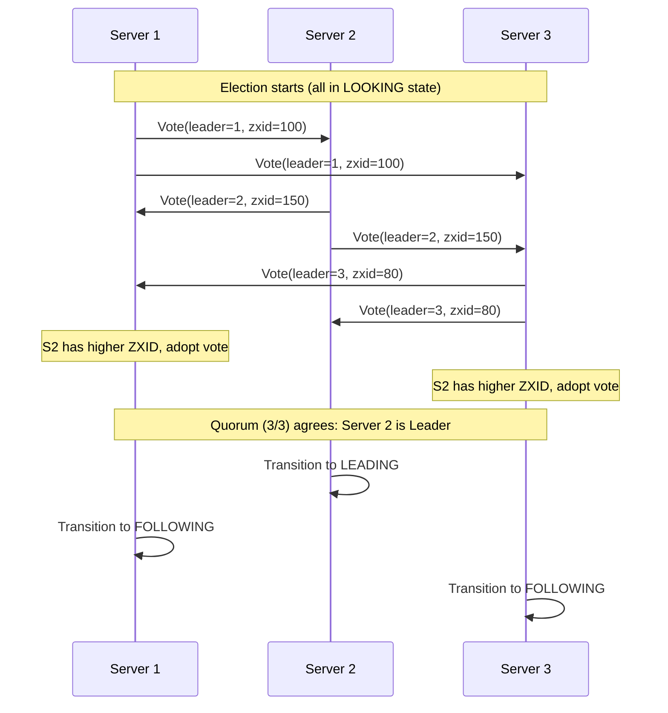
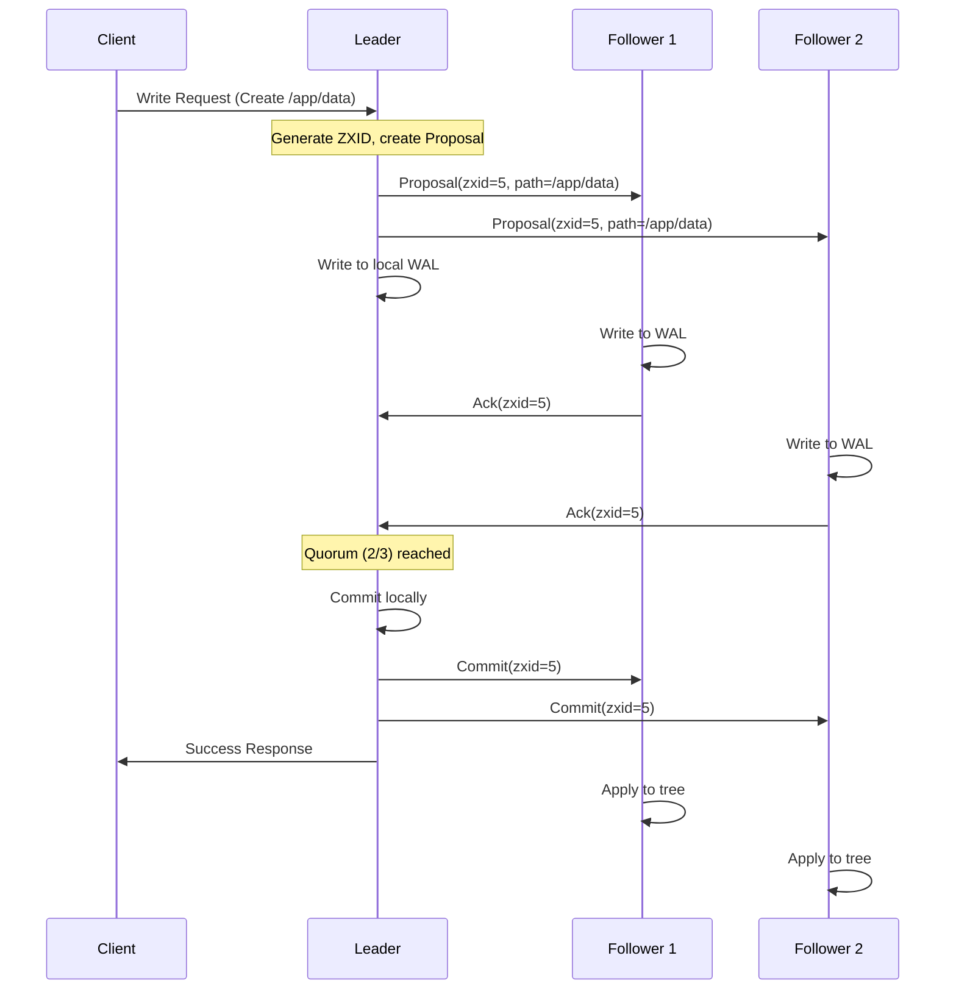

# ZephyrCoord

<div align="center">

**A high-performance, ZooKeeper-compatible distributed coordination service written in Go**

[](https://go.dev/)
[](LICENSE)
[]()
[]()

</div>

---

## 🎯 Overview

ZephyrCoord is a ground-up implementation of the ZooKeeper coordination service, designed for high throughput and low latency. It implements the ZAB (ZooKeeper Atomic Broadcast) protocol for strong consistency across a distributed cluster.

### Key Highlights

- **Wire Protocol Compatible** - Works with existing ZooKeeper clients
- **Sub-millisecond Reads** - Lock-free concurrent access via sharded storage
- **Fault Tolerant** - Leader election and quorum-based replication
- **Efficient Storage** - WAL with group commit + compressed snapshots
- **Production Ready** - CLI, configuration files, metrics, and admin commands
- **Distributed Primitives** - Leader election, locks, barriers, and queues

---

## 🚀 Quick Start

### Installation

```bash
git clone https://github.com/ichbingautam/zephyr-coord.git
cd zephyr-coord
go build ./cmd/zephyr-coord

# Verify installation
./zephyr-coord -version
# ZephyrCoord version 1.0.0
```

---

## 💻 CLI Reference

### Server Startup

When you start ZephyrCoord, you'll see an ASCII banner and status:

```
╔═══════════════════════════════════════════════════════════╗
║                                                           ║
║   ███████╗███████╗██████╗ ██╗  ██╗██╗   ██╗██████╗       ║
║   ╚══███╔╝██╔════╝██╔══██╗██║  ██║╚██╗ ██╔╝██╔══██╗      ║
║     ███╔╝ █████╗  ██████╔╝███████║ ╚████╔╝ ██████╔╝      ║
║    ███╔╝  ██╔══╝  ██╔═══╝ ██╔══██║  ╚██╔╝  ██╔══██╗      ║
║   ███████╗███████╗██║     ██║  ██║   ██║   ██║  ██║      ║
║   ╚══════╝╚══════╝╚═╝     ╚═╝  ╚═╝   ╚═╝   ╚═╝  ╚═╝      ║
║                                                           ║
║               Coordination Service v1.0.0                 ║
║                                                           ║
╚═══════════════════════════════════════════════════════════╝

2026/02/02 00:00:00 Starting ZephyrCoord on :2181
2026/02/02 00:00:00 Data directory: ./zephyr-data
2026/02/02 00:00:00 ZephyrCoord is ready, accepting connections on [::]:2181
```

### Command Line Options

```bash
./zephyr-coord [options]
```

| Flag | Type | Default | Description |
|------|------|---------|-------------|
| `-listen` | string | `:2181` | Client listen address (host:port) |
| `-dataDir` | string | `./zephyr-data` | Data directory for WAL and snapshots |
| `-maxConnections` | int | `10000` | Maximum concurrent client connections |
| `-config` | string | - | Path to zoo.cfg configuration file |
| `-version` | bool | `false` | Print version and exit |
| `-help` | bool | `false` | Print usage information |

### Usage Examples

```bash
# Start with default settings (port 2181)
./zephyr-coord

# Custom port
./zephyr-coord -listen :2182

# Bind to specific interface
./zephyr-coord -listen 192.168.1.100:2181

# Custom data directory
./zephyr-coord -dataDir /var/lib/zephyr

# Limit connections
./zephyr-coord -maxConnections 1000

# Use configuration file
./zephyr-coord -config /etc/zephyr/zoo.cfg

# Production example with all options
./zephyr-coord \
    -listen :2181 \
    -dataDir /var/lib/zephyr \
    -maxConnections 5000 \
    -config /etc/zephyr/zoo.cfg
```

### Graceful Shutdown

ZephyrCoord handles SIGINT and SIGTERM for clean shutdown:

```bash
# Send shutdown signal
kill -SIGTERM $(pgrep zephyr-coord)

# Or press Ctrl+C if running interactively
```

Output on shutdown:

```
2026/02/02 00:05:00 Shutting down...
2026/02/02 00:05:00 ZephyrCoord stopped
```

### Running as a Service

#### systemd (Linux)

Create `/etc/systemd/system/zephyr-coord.service`:

```ini
[Unit]
Description=ZephyrCoord Coordination Service
After=network.target

[Service]
Type=simple
User=zephyr
Group=zephyr
ExecStart=/usr/local/bin/zephyr-coord -config /etc/zephyr/zoo.cfg
ExecReload=/bin/kill -HUP $MAINPID
Restart=on-failure
RestartSec=5
LimitNOFILE=65535

[Install]
WantedBy=multi-user.target
```

Enable and start:

```bash
sudo systemctl enable zephyr-coord
sudo systemctl start zephyr-coord
sudo systemctl status zephyr-coord
```

#### Docker

```dockerfile
FROM golang:1.21-alpine AS builder
WORKDIR /app
COPY . .
RUN go build -o zephyr-coord ./cmd/zephyr-coord

FROM alpine:latest
COPY --from=builder /app/zephyr-coord /usr/local/bin/
EXPOSE 2181
VOLUME ["/data"]
CMD ["zephyr-coord", "-dataDir", "/data", "-listen", ":2181"]
```

Run:

```bash
docker build -t zephyr-coord .
docker run -d -p 2181:2181 -v /data/zephyr:/data zephyr-coord
```

### Health Check

```bash
# Quick health check
echo "ruok" | nc localhost 2181
# imok

# Server statistics
echo "stat" | nc localhost 2181
```

---

## ⚡ Performance

Benchmarked on Apple M4:

| Operation | Latency | Notes |
|-----------|---------|-------|
| Tree.Get | **43 ns** | Lock-free reads via sync.Map |
| Tree.Create | 756 ns | Including shard locking |
| ZXID Generation | 1.7 ns | Atomic operations |
| MemPool Alloc (64B) | 21 ns | Slab allocator reduces GC |
| WAL Batch Append | 786 μs | Group commit for throughput |
| Request Encode | 40 ns | Zero-copy Jute codec |
| ACL Check | 150 ns | Permission verification |
| Metrics Write | 200 ns | Prometheus format |

---

## 🏗️ Architecture

```
┌────────────────────────────────────────────────────────────────────────┐
│                           ZephyrCoord Cluster                          │
│  ┌──────────────┐    ┌──────────────┐    ┌──────────────┐             │
│  │   Leader     │◄──►│   Follower   │◄──►│   Follower   │             │
│  │   Server 1   │    │   Server 2   │    │   Server 3   │             │
│  └──────────────┘    └──────────────┘    └──────────────┘             │
└────────────────────────────────────────────────────────────────────────┘
                                 │
                                 ▼
┌────────────────────────────────────────────────────────────────────────┐
│                         Single Node Architecture                        │
├────────────────────────────────────────────────────────────────────────┤
│   TCP Transport        │   Request Processor   │   Watch Manager       │
│   (10K connections)    │   (CRUD operations)   │   (One-shot triggers) │
├────────────────────────────────────────────────────────────────────────┤
│   ACL Manager          │   Admin Commands      │   Metrics Registry    │
│   (World/Digest/IP)    │   (Four-letter words) │   (Prometheus)        │
├────────────────────────────────────────────────────────────────────────┤
│   Session Manager (Timeout Wheel - O(1) expiry)                        │
├────────────────────────────────────────────────────────────────────────┤
│   Sharded Tree         │       WAL             │      Snapshot          │
│   (256 shards)         │   (Group Commit)      │   (Gzip Compressed)    │
├────────────────────────────────────────────────────────────────────────┤
│                      Memory Pool (Slab Allocator)                       │
└────────────────────────────────────────────────────────────────────────┘
```

---

## 📦 Project Structure

```
zephyr-coord/
├── cmd/zephyr-coord/            # Server binary
│   └── main.go                  # CLI with flags and signal handling
│
├── pkg/
│   ├── zk/                      # Core ZooKeeper types
│   │   ├── zxid.go              # 64-bit transaction ID (epoch|counter)
│   │   ├── stat.go              # Node metadata (88 bytes, cache-aligned)
│   │   ├── znode.go             # Tree node with sync.Map children
│   │   └── acl.go               # Permission model (world, auth, digest, ip)
│   │
│   └── recipes/                 # Distributed coordination primitives
│       ├── election.go          # Leader election (ephemeral sequential)
│       ├── lock.go              # Distributed locks (fair FIFO)
│       └── barrier.go           # Barriers, queues, priority queues
│
├── internal/
│   ├── config/                  # Configuration management
│   │   └── config.go            # zoo.cfg compatible parser
│   │
│   ├── storage/                 # Persistence layer
│   │   ├── tree.go              # Sharded in-memory tree (256 shards)
│   │   ├── mempool.go           # Slab allocator (64B to 1MB classes)
│   │   ├── wal.go               # Write-ahead log with CRC32 checksums
│   │   └── snapshot.go          # Atomic snapshots with cleanup
│   │
│   ├── server/                  # Server components
│   │   ├── transport.go         # TCP server with graceful shutdown
│   │   ├── processor.go         # Request handling pipeline
│   │   ├── server.go            # Main server coordinator
│   │   ├── datastore.go         # Coordinates tree + WAL + snapshot
│   │   ├── session.go           # Session manager with timeout wheel
│   │   ├── watch.go             # Watch registry (lock-free sync.Map)
│   │   ├── acl.go               # ACL manager with auth providers
│   │   ├── admin.go             # Four-letter admin commands
│   │   └── metrics.go           # Prometheus-compatible metrics
│   │
│   ├── protocol/                # Wire protocol
│   │   ├── codec.go             # Jute-compatible binary encoder/decoder
│   │   └── request.go           # ZooKeeper request/response types
│   │
│   └── cluster/                 # Distributed consensus
│       ├── peer.go              # Peer connection management
│       ├── zab.go               # ZAB protocol message types
│       ├── election.go          # FastLeaderElection algorithm
│       ├── leader.go            # Leader broadcast and commit
│       ├── follower.go          # Follower sync and heartbeats
│       └── cluster.go           # Main cluster coordinator
│
└── README.md
```

---

## ⚙️ Configuration

### zoo.cfg Format (ZooKeeper Compatible)

```properties
# Basic Settings
dataDir=/var/zephyr
clientPort=2181
tickTime=2000

# Timeouts
initLimit=10
syncLimit=5
minSessionTimeout=4000
maxSessionTimeout=40000

# Limits
maxClientCnxns=10000

# Admin & Metrics
admin.enableServer=true
admin.serverPort=8080
metricsProvider.enabled=true

# Cluster Configuration (for ensemble)
server.1=host1:2888:3888
server.2=host2:2888:3888
server.3=host3:2888:3888
```

Generate an example config:

```go
import "github.com/ichbingautam/zephyr-coord/internal/config"
config.WriteExample("zoo.cfg")
```

---

## 🔐 Access Control Lists (ACLs)

### Supported Schemes

| Scheme | Description | Example |
|--------|-------------|---------|
| `world` | Everyone | `world:anyone` |
| `digest` | Username:password | `digest:user:encodedPass` |
| `ip` | IP address or CIDR | `ip:192.168.1.0/24` |

### Usage

```go
// Create with world ACL (open access)
acl := zk.WorldACL(zk.PermAll)

// Create with digest authentication
acl := zk.DigestACL(zk.PermAll, "user", "password")

// IP-based access
acl := []zk.ACL{{
    Perms:  zk.PermRead,
    Scheme: "ip",
    ID:     "10.0.0.0/8",
}}
```

### Permission Bits

| Permission | Value | Description |
|------------|-------|-------------|
| `PermRead` | 1 | Read data |
| `PermWrite` | 2 | Write data |
| `PermCreate` | 4 | Create children |
| `PermDelete` | 8 | Delete children |
| `PermAdmin` | 16 | Set ACLs |
| `PermAll` | 31 | All permissions |

---

## 📊 Admin Commands (Four-Letter Words)

Compatible with ZooKeeper's four-letter commands:

| Command | Description |
|---------|-------------|
| `ruok` | Returns "imok" if server is running |
| `stat` | Server statistics |
| `srvr` | Server info with latency |
| `conf` | Configuration details |
| `envi` | Environment info |
| `mntr` | Monitoring metrics (Prometheus-style) |
| `wchs` | Watch summary |
| `cons` | Connection summary |
| `srst` | Reset statistics |
| `isro` | Read-only status |

### Usage

```bash
echo "ruok" | nc localhost 2181
# imok

echo "mntr" | nc localhost 2181
# zk_version  1.0.0
# zk_avg_latency  0
# zk_num_alive_connections  5
# zk_znode_count  100
# ...
```

---

## 📈 Metrics

Prometheus-compatible metrics endpoint:

```
# HELP zephyr_requests_total Total number of requests processed
# TYPE zephyr_requests_total counter
zephyr_requests_total 15234

# HELP zephyr_active_connections Number of active client connections
# TYPE zephyr_active_connections gauge
zephyr_active_connections 42

# HELP zephyr_request_duration_seconds Request latency histogram
# TYPE zephyr_request_duration_seconds histogram
zephyr_request_duration_seconds_bucket{le="0.001"} 12000
zephyr_request_duration_seconds_bucket{le="0.01"} 14500
...

# Go runtime metrics
go_goroutines 50
go_heap_alloc_bytes 12345678
```

---

## 🍳 Distributed Recipes

### Leader Election

```go
import "github.com/ichbingautam/zephyr-coord/pkg/recipes"

election := recipes.NewLeaderElection(client, "/election", "node-1", nil)
election.Start()

election.OnLeadershipChange(func(isLeader bool) {
    if isLeader {
        log.Println("I am the leader!")
    }
})

// Check leadership
if election.IsLeader() {
    // Do leader work
}

election.Stop()
```

### Distributed Lock

```go
lock := recipes.NewDistributedLock(client, "/locks/mylock", "client-1")

// Blocking acquire
ctx, cancel := context.WithTimeout(context.Background(), 10*time.Second)
if err := lock.Lock(ctx); err != nil {
    log.Fatal("failed to acquire lock")
}

// Do critical section work
doWork()

lock.Unlock()
```

### Barrier

```go
// Synchronize 3 parties
barrier := recipes.NewBarrier(client, "/barrier", 3, "party-1")

// All parties must call Enter before any can proceed
barrier.Enter(context.Background())

// All parties are now synchronized
doWork()

barrier.Leave()
```

### Queue

```go
queue := recipes.NewQueue(client, "/queue")

// Producer
queue.Offer([]byte("task-1"))
queue.Offer([]byte("task-2"))

// Consumer
data, _ := queue.Poll()  // Non-blocking
data, _ := queue.Take(ctx)  // Blocking
```

---

## 🔧 Core Components

### FastLeaderElection


```mermaid
sequenceDiagram
    participant S1 as Server 1
    participant S2 as Server 2
    participant S3 as Server 3

    Note over S1,S3: Election starts (all in LOOKING state)

    S1->>S2: Vote(leader=1, zxid=100)
    S1->>S3: Vote(leader=1, zxid=100)
    S2->>S1: Vote(leader=2, zxid=150)
    S2->>S3: Vote(leader=2, zxid=150)
    S3->>S1: Vote(leader=3, zxid=80)
    S3->>S2: Vote(leader=3, zxid=80)

    Note over S1: S2 has higher ZXID, adopt vote
    Note over S3: S2 has higher ZXID, adopt vote

    Note over S1,S3: Quorum (3/3) agrees: Server 2 is Leader

    S2->>S2: Transition to LEADING
    S1->>S1: Transition to FOLLOWING
    S3->>S3: Transition to FOLLOWING
```

### ZAB Broadcast Protocol


```mermaid
sequenceDiagram
    participant C as Client
    participant L as Leader
    participant F1 as Follower 1
    participant F2 as Follower 2

    C->>L: Write Request (Create /app/data)

    Note over L: Generate ZXID, create Proposal

    L->>F1: Proposal(zxid=5, path=/app/data)
    L->>F2: Proposal(zxid=5, path=/app/data)
    L->>L: Write to local WAL

    F1->>F1: Write to WAL
    F1->>L: Ack(zxid=5)

    F2->>F2: Write to WAL
    F2->>L: Ack(zxid=5)

    Note over L: Quorum (2/3) reached

    L->>L: Commit locally
    L->>F1: Commit(zxid=5)
    L->>F2: Commit(zxid=5)
    L->>C: Success Response

    F1->>F1: Apply to tree
    F2->>F2: Apply to tree
```

---

## 🧪 Testing

```bash
# Run all tests
go test -v ./...

# With race detector
go test -race ./...

# Benchmarks
go test -bench=. -benchmem ./...

# Specific package
go test -v ./internal/server/...
go test -v ./pkg/recipes/...
```

### Test Coverage

```
ok  internal/cluster   (race) ✅
ok  internal/config    (race) ✅
ok  internal/protocol  (race) ✅
ok  internal/server    (race) ✅
ok  internal/storage   (race) ✅
ok  pkg/recipes        (race) ✅
ok  pkg/zk             (race) ✅
```

---

## 🔬 Design Decisions

### Why sync.Map for children?

- Lock-free reads for high read throughput
- ZK workloads are typically read-heavy (10:1 ratio)

### Why 256 shards?

- Balances lock contention vs memory overhead
- FNV-1a provides good distribution

### Why group commit for WAL?

- Amortizes fsync cost across multiple operations
- Improves throughput by 10-100x

### Why timeout wheel for sessions?

- O(1) add/remove/tick operations
- More efficient than heap-based timers for many sessions

### Why ephemeral sequential for recipes?

- Automatic cleanup on session expiry
- Sequential ordering enables fair locking

---

## 📚 References

### Academic Papers

- [ZooKeeper: Wait-free Coordination for Internet-scale Systems](https://www.usenix.org/conference/usenix-atc-10/zookeeper-wait-free-coordination-internet-scale-systems) - Original ZooKeeper paper (USENIX ATC 2010)
- [Zab: High-performance broadcast for primary-backup systems](https://ieeexplore.ieee.org/document/5958223) - ZAB protocol specification (IEEE DSN 2011)
- [Paxos Made Simple](https://lamport.azurewebsites.net/pubs/paxos-simple.pdf) - Foundational consensus algorithm by Leslie Lamport
- [The Chubby Lock Service](https://research.google/pubs/the-chubby-lock-service-for-loosely-coupled-distributed-systems/) - Google's distributed lock service
- [Raft: In Search of an Understandable Consensus Algorithm](https://raft.github.io/raft.pdf) - Alternative consensus approach

### Implementation Resources

- [Apache ZooKeeper Source](https://github.com/apache/zookeeper) - Official Java implementation
- [Jute Serialization Format](https://github.com/apache/zookeeper/tree/master/zookeeper-jute) - Wire protocol specification
- [ZooKeeper Internals](https://zookeeper.apache.org/doc/current/zookeeperInternals.html) - Official architecture docs

### Go Concurrency Patterns

- [sync.Map Documentation](https://pkg.go.dev/sync#Map) - Lock-free concurrent map
- [Go Memory Model](https://go.dev/ref/mem) - Understanding atomic operations
- [Effective Go: Concurrency](https://go.dev/doc/effective_go#concurrency) - Goroutine best practices

### Related Projects

- [etcd](https://github.com/etcd-io/etcd) - Distributed KV store using Raft
- [Consul](https://github.com/hashicorp/consul) - Service mesh with consensus
- [go-zookeeper](https://github.com/go-zookeeper/zk) - Go client library for ZooKeeper

---

## 📄 License

MIT License - see [LICENSE](LICENSE) for details.

---

<div align="center">
<sub>Built with ❤️ in Go | 22 commits | ~12,000 lines</sub>
</div>
